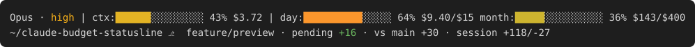

# claude-budget-statusline

A two-line statusline for Claude Code: model, effort, context use, session
cost, the prompt cache's countdown and two budget bars on the first line;
directory, branch and diff on the second. Every element can be switched off
in `config/display.conf` (see [Elements](#elements)).



```
Opus · high | ctx:█████░░░░░░ 43% $3.72 · cache 42m | day:███████░░░░ 64% $9.40/$15 month:██│█░░░░░░░ 36% $143/$400
~/claude-budget-statusline ⎇  feature/preview · pending +16 · vs main +30 · session +118/-27
```

A Friday afternoon: $9.40 of today's $15 allowance spent, $143 of the $400
month, and the light tick in the month bar says the month's workdays are a
fifth gone, so the fill just past it is a little ahead of pace. The
conversation's prompt cache stays warm for another 42 minutes. The same line
on a Saturday reads `off:` instead of `day:`; past the limit the month bar
pegs and a coral `+$20` follows it; once no fetch has succeeded for five
minutes a dim `·12m` age tag closes the segment. In a linked worktree
(Claude Code's `--worktree` sessions, or one you made with `git worktree
add`) the second line starts from the main repository instead:

```
~/claude-budget-statusline › wt-demo ⎇  feature/wt · pending +16
```

The budget bars:

- **day** — today's spend against today's allowance. The allowance divides the
  month's *remaining* budget evenly over the remaining workdays of the month
  (the days you work, minus holidays, per `config/calendar.conf`), so a heavy
  day early in the month shrinks the days after it, and a quiet day gives the
  rest of the month room. On a day you don't work the label reads `off:` and
  the allowance shown is the next workday's slice, which that day's spend
  draws down.
- **month** — month-to-date spend against the monthly limit. Past the limit
  the bar pegs and shows the overage. The tick marks today's place in the
  month's workdays (elapsed over total, from the same calendar): fill short
  of it is under pace, fill past it is over. On the last workday it sits on
  the final cell, a finish line the fill meets at the limit; past the limit
  it stays put over the pegged fill.

And on the ctx segment, after the session cost:

- **cache** — the prompt cache's state for this conversation, from the
  `prompt_cache` object Claude Code reports after the first response. Each
  request re-reads the conversation's cached prefix at a fraction of the
  input price while the cache is warm, and pays to write it all again once
  it has expired. `cache 42m` counts down to that expiry, dim; it turns gold
  in the last five minutes of a one-hour cache (the last minute of a
  five-minute one), when one more turn keeps the prefix and an idle wait
  loses it; `cache cold ↻38k` in coral means the next request re-caches
  38k tokens. Hidden until caching has been observed.

Both read the same numbers the `/usage` page shows, so there is no local token
pricing to drift. This is for organization or Team accounts with spend
billing, where the `/usage` page shows dollars; see Prerequisites.

## Elements

Everything the statusline can show, by name. The first line holds the
model, the context and the budget bars (the budget bars move to a row of
their own when the terminal is too narrow for one); the repository row is
last. Some elements hang off another and go with it when that one is
hidden.

| Name | On screen | What it is | Needs |
|------|-----------|------------|-------|
| `model` | `Opus` | the model's display name | |
| `effort` | `· high` | the effort level, coloured on the same green-to-coral ramp as the bars | `model` |
| `ctx` | `ctx:█████░░ 43%` | context use, from `context_window.used_percentage` | |
| `cost` | `$3.72` | the session's cost so far | `ctx` |
| `cache` | `· cache 42m` | the prompt cache's state: minutes left while warm (gold in its last five, or the last one of a 5m cache), `cache cold ↻38k` once expired with the tokens the next request re-caches | `ctx` |
| `day` | `day:███░░ 64% $9.40/$15` | today's spend against today's allowance, the month's remaining budget spread over its remaining workdays; `off:` on a day you don't work | |
| `month` | `month:██│█░ 36% $143/$400` | month-to-date spend against the limit; past it the bar pegs and a coral `+$20` follows | |
| `pace` | `│` | the tick in the month bar: today's place in the month's workdays, so fill short of it is under pace | `month` |
| `age` | `·12m` | how long since a usage fetch last succeeded, once that is five minutes or more | `day` or `month` |
| `repo` | | the whole repository row | |
| `path` | `~/claude-budget-statusline` | the working directory, `~`-shortened and squeezed past 35 characters (`~/g/project`). In a linked worktree: the main repository's path, a dim `›`, then the worktree's name bright (`~/git/project › wt-demo`, with any directory below the worktree after the name) | `repo` |
| `branch` | `⎇  feature/preview` | the branch (the short hash when detached), preceded by the remote's repository name in parentheses when the directory is named differently (not in a worktree, where the breadcrumb already says where it lives) | `repo` |
| `pending` | `· pending +16/-2` | uncommitted lines against HEAD, untracked text files included; its presence is the dirty flag | `branch` |
| `upstream` | `↑1↓2` | commits ahead of and behind the upstream branch, as of the last fetch (the statusline never fetches) | `branch` |
| `vs` | `· vs main +30` | lines changed against the default branch, hidden on it | `branch` |
| `session` | `· session +118/-27` | lines Claude Code has added and removed this session, from its own counters | `repo` |

Every element hides itself when it has nothing to show (no budget figure,
a clean tree, a session with no edits), so a quiet state collapses to
`Opus | ctx:… | day:… month:…` over `~/project ⎇  main`.

The worktree is detected through git (the common dir differs from the
checkout's own git dir), not through Claude Code's input, so a worktree
made by hand renders the same as a `--worktree` session; `pending`,
`upstream` and `vs` describe the worktree's own tree and branch. A git
older than 2.31 lacks the query and gets the plain form.

### Which elements show

`config/display.conf`, next to the calendar, lists what to hide, one or
more names per line:

```
hide pace cache
hide session
```

Names are case-insensitive, space or comma separated; `#` starts a
comment; lines accumulate. No file, or a file with no `hide` line, shows
everything. Hiding an element hides whatever hangs off it (`hide ctx`
takes the cost and the cache cue with it), and the row re-flows around the
gap, so the bars widen. Hiding both `day` and `month` also switches the
usage fetch off entirely: no credentials are read and no request is made,
so a statusline that only wants the repository row makes no network calls.
Names that don't exist are skipped and reported. The rows and their order
are fixed; the file cannot rearrange them.

```
bash statusline/budget-statusline.sh --display
```

prints the file in use and one line per element, `on`, `off`, or `off
(needs ctx)` for one hidden through its parent, with the description, then
any line it skipped. The `/budget-statusline:display` skill edits the
installed file for you: "hide the pace tick", "what is hidden", "why did
the cache cue disappear".

> **Note on the data source.** The script calls `api.anthropic.com/api/oauth/usage`
> with the CLI's own OAuth token — the same request the `/usage` command makes.
> The token is read from the CLI's credentials file, sent only to that host, and
> never written to disk or logged; the cache holds dollar totals only. The
> endpoint is not publicly documented and may change without notice; if it
> does, the budget bars go blank and the rest of the line keeps working
> (`LIVE=1 bats tests/live.bats` tells you whether it has). This
> project is not affiliated with or supported by Anthropic.

## Install

**As a Claude Code plugin**, from the `claude-toolbox` marketplace:

```
/plugin marketplace add MasonFlint44/claude-toolbox
/plugin install budget-statusline@claude-toolbox
/budget-statusline:install
```

The install skill copies the files to `~/.claude/statusline/`, adds the
`statusLine` line to your settings (showing you the change before writing
it), and runs the doctor once so the bars are filled on the first render.
Re-run it after a plugin update to refresh the copy. Plugins can't set
`statusLine` themselves and the plugin directory moves on each version
update, which is why the install step exists.

**By hand:** copy the `statusline/` directory somewhere stable, keeping its
`config/` subfolder (the script finds it relative to itself),
then add to `~/.claude/settings.json`:

```json
"statusLine": { "type": "command", "command": "bash /path/to/statusline/budget-statusline.sh" }
```

No restart needed: Claude Code picks up the change on its next refresh. The
first render shows blanks for the budget bars; they fill within a minute once
the background fetch has run.

## Files

| File | Purpose |
|------|---------|
| `statusline/budget-statusline.sh` | the statusline itself |
| `statusline/config/calendar.conf` | the calendar — which days you work and which dates are holidays. Ships with a Monday-to-Friday week and the US federal holidays; edit to match yours, add closures or PTO as `once` lines. Yours once installed: the installer never overwrites it |
| `statusline/config/display.conf` | which elements show (see [Elements](#elements)). Ships hiding nothing, with every name described in its comments. Yours once installed, like the calendar |

The calendar is one entry per line. Keywords, day names and modes are
case-insensitive; only the names are free text.

- `workdays DAYS` — the days you work: a wrapping range (`mon-fri`, `sun-thu`),
  a list (`mon,tue,wed,thu`), a mix (`mon-wed,fri`) or `all`. Default `mon-fri`;
  if the line appears more than once the last one wins, as with `observe`.
- `fixed MM-DD`, `nth N DOW MM`, `last DOW MM` — yearly holidays, each
  followed by a name (`nth 4 thu 11 Thanksgiving Day`).
- `once YYYY-MM-DD[..YYYY-MM-DD] name` — a one-off date or inclusive range,
  for PTO and closures. Never shifted; one on a day you don't work anyway
  simply has no effect.
- `observe MODE [DOW=MODE ...]` — how a yearly holiday that falls on a day
  you don't work is observed. `nearest` moves it to the nearest workday, ties
  going forward; `next` and `prev` always go that way; `none` gives no
  substitute day. A `DOW=MODE` token overrides the mode for one day. The
  substitute skips days that are already yearly holidays, so Christmas and
  Boxing Day chain onto Monday and Tuesday, but not `once` days: a holiday
  observed on a day you had already taken off is still observed there. If no
  free workday exists within two weeks there is no substitute. Because the
  modes follow the `workdays` line, changing your week doesn't mean rewriting
  this line. Common settings:

| | |
|---|---|
| `observe nearest` | US federal (the default) |
| `observe next` | UK, Ireland, Australia, New Zealand, Canada |
| `observe next sat=none` | Japan |
| `observe none` | no substitution (most of continental Europe) |

To check the calendar:

```
bash statusline/budget-statusline.sh --calendar 2027
```

It prints the file in use, the work week, the observe policy, every holiday
with its observed date (tagged when it was shifted or has no effect), and for the current year
this month's total and remaining workday counts. Lines that don't parse are
reported. The listing is by the holiday's own year, so a New Year's Day
observed on the previous December 30 or 31 appears under the new year, the
way official calendars print it. The workday math itself goes by the observed
date.

The `/budget-statusline:calendar` skill edits the installed calendar for you: "add PTO
next week", "we work Sunday to Thursday", "show my budget calendar".

## When the bars are blank

Every failure hides the bars the same way, so the script can explain itself:

```
bash ~/.claude/statusline/budget-statusline.sh --doctor
```

runs the refresh in the foreground one step at a time (credentials, a live
fetch of the usage endpoint, the limit, the cache) and stops at the first
failing step with the reason and the fix; exit 1 means the bars would stay
hidden. Run it with any knobs your `statusLine` command sets. The
`/budget-statusline:doctor` skill does the same from inside Claude Code ("my budget
bars are blank"), finding the installed script for you. The doctor also
names the display file and what it hides, since a bar switched off there
is not a failure: with both budget bars hidden it reports that and exits 0.
`--help` lists the flags and knobs.

## Prerequisites

- **A Claude Code login through claude.ai on a plan that reports dollar
  spend.** The budget bars read the CLI's OAuth token from
  `~/.claude/.credentials.json` and need the usage response to carry a
  month-to-date dollar figure, which organization plans with spend billing
  do. With an API key there is no token; with a plan whose `/usage` page
  shows no dollar amount, or an organization with spend billing switched
  off, there is no figure. In every such case the bars stay hidden and the
  rest of the line still renders.
- `bash` 4.4+ (an older one prints one line saying so and exits), `jq`,
  `curl`, `awk` (busybox's is fine), `readlink -f`, `sort`, `xargs`, `find`
  and `grep`. All the date arithmetic is done in bash, so no GNU `date`.
- `git` — only for the branch and diff segment; blank without it.
- `tput` — optional, for the terminal width when `COLUMNS` is unset.

Linux and devcontainers work as-is and are what the test suite runs on.
Other platforms, untested so far (reports welcome):

- **macOS:** needs a bash 4.4+ from Homebrew (`brew install bash`; the
  system bash is 3.2). The install skill finds it and names it in the
  `statusLine` command; by hand, write `/opt/homebrew/bin/bash` (Intel:
  `/usr/local/bin/bash`) there instead of `bash`. Also `readlink -f`, which
  macOS has had since 12.3. Claude Code keeps the token in the Keychain there rather than
  in the credentials file; when the file is absent the script asks the
  Keychain for the `Claude Code-credentials` item (the first read may
  prompt once for access; allow it always). `--doctor` shows which source
  it used.
- **Windows:** through Git for Windows' bash, which Claude Code uses as its
  shell when present; `jq` must be installed separately (`winget install
  jqlang.jq`). The credentials file is where the script expects it. WSL
  counts as Linux.

## How the daily number works

The usage endpoint has no per-day figure, so the script derives one: the first
time it sees a new calendar day it records the month-to-date total as that
day's baseline, and daily = month − baseline. Accurate from the first refresh
of the day. The day rolls at **local midnight** unless `CLAUDE_BUDGET_TZ` says
otherwise; the month figure is server-side and rolls at 00:00 UTC on the last
day. Cache and baseline live in
`~/.claude/cache/statusline/` (inside the config dir so a devcontainer that
mounts `~/.claude` carries them along). The baseline is per machine: the month
figure covers every machine on the account, but a second machine that first
sees the day at noon takes the morning's spend elsewhere into its baseline and
shows a smaller day figure. The month bar is the same everywhere.

## Knobs

- `CLAUDE_BUDGET_MONTHLY_LIMIT` — your own monthly target in dollars. Set, it
  is the limit the bars use even if the org's is higher; unset, the limit in
  the usage response is used. With neither the budget bars stay hidden.
- `CLAUDE_BUDGET_TZ` — the clock the day bar and workday count run on, as a
  time zone name (`UTC`, `America/New_York`). Default: local time. A name the
  system doesn't know silently means UTC, as with `TZ`.
- `CLAUDE_BUDGET_REFRESH` — seconds between usage fetches. Default 60,
  minimum 10; anything else falls back to 60. The fetch runs detached and
  never blocks a render. A failed fetch waits one interval before retrying,
  and an HTTP 429 waits five minutes. While fetches keep failing the last
  figures stay up, with a dim age tag (`·12m`, `·3h`) after the bars from
  five minutes on; at midnight they hide, since yesterday's daily total
  would be wrong for today.
- `CLAUDE_BUDGET_CALENDAR` — path to a calendar file, if not the default;
  `off` means no file at all: a Monday-to-Friday week with no holidays.
- `CLAUDE_BUDGET_DISPLAY` — path to a display file, if not the default;
  `off` means no file at all: every element shows. What shows is decided
  by the file alone; there are no per-element environment switches.
- `CLAUDE_CONFIG_DIR` — honored, same as Claude Code.

`off`, `none`, `no`, `0` and `false` all mean off, in any case.

Set knobs in the environment Claude Code starts from, or inline in the
`statusLine` command, e.g. `"command": "CLAUDE_BUDGET_TZ=UTC bash /path/to/budget-statusline.sh"`.

## Tests

```
bats tests/                       # the whole suite (~30 s), no network
bats tests/calendar.bats          # one area
UPDATE=1 bats tests/calendar.bats # rewrite the golden listings
LIVE=1 bats tests/live.bats       # probe the real endpoint with your credentials
DOCKER=1 bats tests/compat.bats   # other bash versions, in Docker
```

[Bats](https://github.com/bats-core/bats-core) (`apt install bats`) plus
libfaketime (`apt install libfaketime`), so every run sees the same clock:
Saturday 2026-09-05 in America/Chicago. The locale tests compile a German
locale into a temp directory with `localedef` (from the `locales` package)
and nothing is installed system-wide. One file per area:

| File | Covers |
|------|--------|
| `calendar.bats` | golden `--calendar` listings for the fixtures in `tests/calendars/` (expected output in `tests/expected/`) |
| `render.bats` | the budget line from a hand-written cache line: labels, allowances, hidden states |
| `fetch.bats` | the usage fetch through a fake `curl` (`tests/bin/curl`): request shape, response shapes, day-start baseline, limit precedence, every failure's hold |
| `trigger.bats` | when a render starts a refresh: cache age, hold, lock, `CLAUDE_BUDGET_REFRESH` |
| `layout.bats` | bar widths across terminal widths, the two-row split, model/effort/context/cost pieces |
| `pace.bats` | the month bar's pace tick: its cell for workdays, weekends, holidays, the last workday, past the limit, across budget clocks |
| `display.bats` | the display file: each element hidden alone, dependents following their parent, the row re-flowing, the fetch skipped with both budget bars hidden, the file's parsing, golden `--display` listings |
| `cache.bats` | the prompt-cache cue: countdown, the gold window per TTL, the cold form with its re-cache figure, when it hides, its width |
| `colors.bats` | the escapes: ramp colours on bars and effort, dim annotations, input text printed verbatim |
| `repoline.bats` | the location row against a scratch git repository with a remote, and each of its elements hidden through the display file |
| `worktree.bats` | the row inside linked worktrees: under `.claude/worktrees/`, beside the repo, nested directories, long names, detached, dirty, the colours, the display names, and a git without `--path-format` |
| `locale.bats` | comma-decimal locales, with the locale built on the fly |
| `cli.bats` | flag handling |
| `doctor.bats` | `--doctor` and `--help`: every step's failure line and exit status, the Keychain fallback through a fake `security` (and that Linux never calls it) |
| `compat.bats` | bash 3.2, 4.3 and 4.4 through Docker's `bash` images: the version guard's one line on the old ones, a full render on 4.4 (Alpine, busybox awk). Only with `DOCKER=1`; CI sets it |
| `live.bats` | the drift probe: the real endpoint with your own credentials, only with `LIVE=1`, never in CI. Fails when the response no longer has the shape recorded in `tests/fixtures/usage-response.json` |

CI runs the suite and `shellcheck` on every push. `docs/preview.py`
regenerates the README preview from the script itself (python3, git and
libfaketime), so the picture cannot drift from the code.

The four skills are prose for the model, so they are checked differently:
`tests/skills/run.sh` runs each case under `tests/skills/cases/` through
headless Claude (`claude -p`) with this plugin loaded and a throwaway config
dir, then checks the files the skill left behind (the calendar line landed
in the file the `statusLine` command names, the plugin's own copy is
untouched, an edited calendar survives an update, settings point at the
stable copy). Every run is a paid model call, so it is run by hand:

```
tests/skills/run.sh                 # all cases, sonnet
tests/skills/run.sh -m fable -n 3   # another model, three runs per case
```

It copies your credentials file into the throwaway dir for the CLI and
copies it back if the token was refreshed; with `ANTHROPIC_API_KEY` set it
leaves the credentials alone. Transcripts go to `tests/skills/results/`. Each
run gets a throwaway HOME and config dir and bypasses permission prompts,
which a headless session cannot answer (the write to `settings.json` always
asks); that applies to the test runner only, never to the installed
statusline or the skills in normal use.

Whether the skills *trigger* on the right requests is a separate question, checked with the
[skill-creator](https://github.com/anthropics/claude-plugins-official) plugin's description
evaluator over twenty queries per skill in `tests/skills/triggers/` (ten that should trigger,
ten near-misses that should not):

```
tests/skills/triggers.sh -e [-m MODEL] [-r RUNS] [SKILL...]   # score the current descriptions
tests/skills/triggers.sh [-m MODEL] [SKILL...]                # optimizer: proposes a better description
```

The optimizer never edits `SKILL.md`; it prints the best description it found, scored on a
held-out split, for you to paste in. `-e -m haiku -r 1` is a two-minute smoke test per skill.

## License

MIT — see `LICENSE`. Version history in `CHANGELOG.md`.
